# VEX High-Stakes - Codebase  
*A modular, multithreaded control stack built with PROS for [vex robotics competition](https://www.vexrobotics.com/v5/competition/vrc-current-game).*

  

---

## Project Overview
This repository contains the **competition-ready control stack** for a VEX robot that:
* Scores mobile goals and wall-stakes rings using a vertical lift (“Lady Brown”)
* Dynamically **sorts rings by alliance color** while intaking at full speed
* Executes multi-stage **autonomous paths** with odometry, pure-pursuit, and boomerang planners
* Runs a **PID-tuned chassis** capable of sub-inch accuracy
* Utilizes **multithreaded subsystems** (Intake, Lift, Clamp, Timer, HUD) running under a lightweight RTOS

The codebase is fully documented with Doxygen-style comments, self-contained headers, and an intuitive folder layout—ready for recruiters, judges, and teammates to explore.

---

## Key Features
| Category | Highlight |
| -------- | --------- |
| **Color Sorting** | Optical sensors detect ring hue; mismatched rings auto-eject in real time |
| **Auton Selector** | LCD + limit-switch interface to choose from 15 autonomous modes |
| **PID-Driven Chassis** | Independent drive/turn/swing PID loops, plus slew-rate limiting |
| **Full Odometry** | Dual tracking wheels + IMU, boomerang & pure-pursuit planners |
| **Rumble Alerts** | Controller vibrates during end-game (35-30 s) for strategic cues |
| **Multithreading** | PROS tasks isolate Intake, Lift, Clamp, Screen HUD, and Timer |
| **Failsafe Handling** | Automatic jam recovery & interference “tug” routine |
| **On-Controller Tuning** | Live PID tuner UI (A/Y/X buttons) for rapid iteration |

---

## Demo

| Clip | Behaviors Highlighted |
| ---- | --------------------- |
| | Intake color-sorts a red ring, auto-reverses, resumes fast intake |
|  | Lift PID set to wallstake position then automatically back to primed |
|  | Motion-chaining example with a turn to align to the second goal |

---

## High-Level Architecture

---

## PID Control
> *PID wrappers are configured in [`default_constants()`](src/autons.cpp).*  
> The robot uses **independent, decoupled PID loops** for linear motion, heading hold, swing turns, and pure-pursuit angular correction.

### Control-Loop Model

```mermaid
flowchart LR
  ref["Reference<br/>(target)"]
  sum["Σ&nbsp;(summer)"]
  ctrl["PID<br/>controller"]
  volt["Motor<br/>voltage"]
  plant["Chassis<br/>plant"]
  meas["Actual<br/>pose"]

  ref --> sum
  meas -.-> sum
  sum --> ctrl
  ctrl --> volt
  volt --> plant
  plant --> meas
```

### Continuous-Time Law

$$
u(t) = K_p\,e(t) + K_i\!\!\int_{0}^{t}\! e(\tau)\,d\tau + K_d\,\frac{de(t)}{dt}
$$

where $e(t)=r(t)-y(t)$. Gains $\{K_p,K_i,K_d\}$ are first swept with Ziegler–Nichols, then refined via a **second-order inertia model**.

### Discrete Implementation (100 Hz)

$$
u[k] = K_p\,e[k] + K_i\,\sum_{i=0}^{k} e[i]\,\Delta t + K_d\,\frac{e[k]-e[k-1]}{\Delta t}
$$

Integral term is clamped to $\pm I_{\max}$ for anti-windup.

| Loop          |    $K_p$ | $K_i$ | $K_d$ | Notes                    |
| ------------- | -------: | ----: | ----: | ------------------------ |
| Drive dist.   | **19.4** |     0 |   109 | Slew-limited ±70 V/s     |
| Heading hold  |     10.7 |     0 |    21 | Cascaded with Drive      |
| Turn-in-place |      3.3 |     0 | 28.75 | Raw IMU                  |
| Swing         |      6.0 |     0 |    65 | Outer wheel only         |
| Odom θ        |      6.5 |     0 |  52.5 | Pure-pursuit / boomerang |

---

## 🧵 Multithreading Model

| Task                | Priority | Period | Function          |
| ------------------- | -------: | -----: | ----------------- |
| IntakeController    |       30 |  10 ms | Color sort & jams |
| LiftController      |       28 |  20 ms | PID height        |
| CompTimerController |       20 | 100 ms | Rumble alerts     |
| opcontrol           |       26 |  10 ms | Drive & pistons   |

*Worst-case input-to-voltage latency ≈ **2 ms**.*

---

